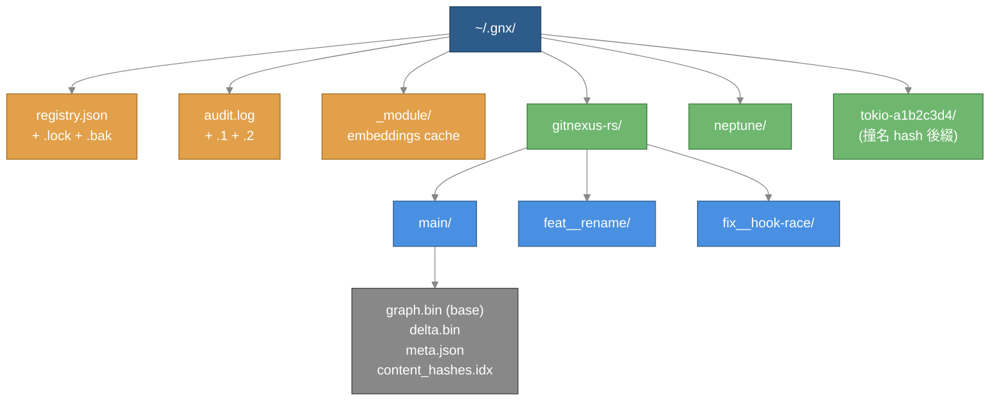
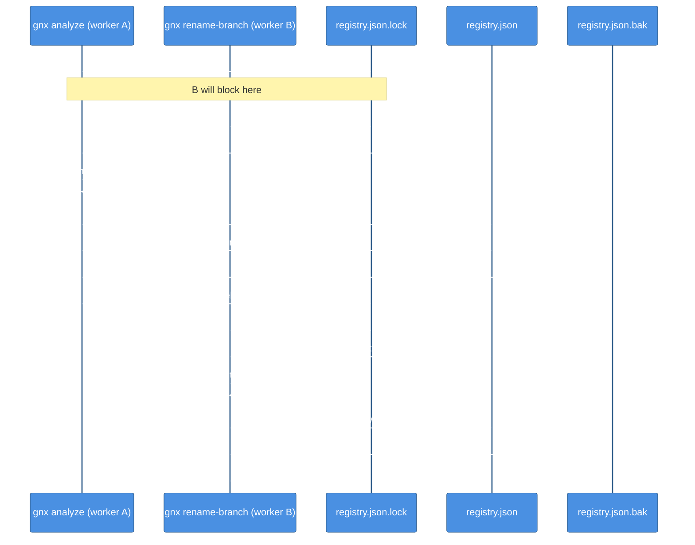
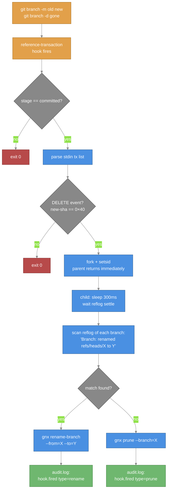
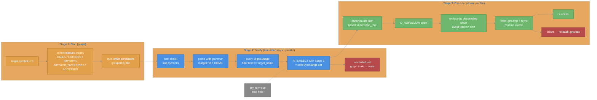
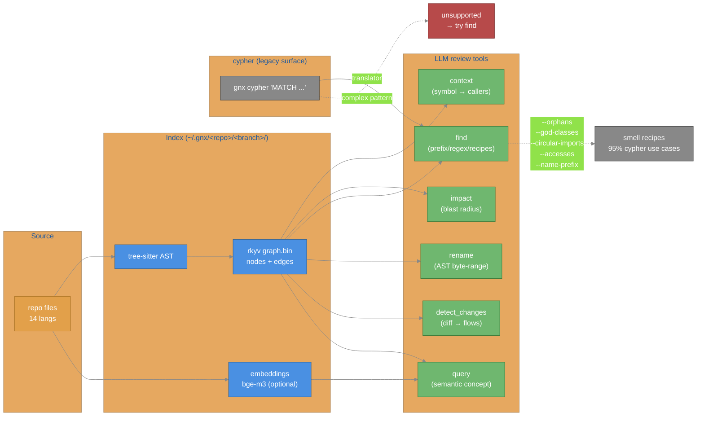
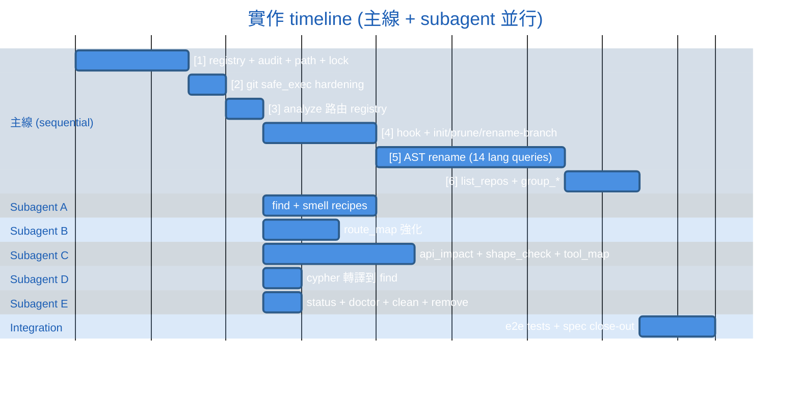

# gnx-rs 對齊 + 多 branch + AST rename 設計

**日期**：2026-05-14
**狀態**：waiting review
**作者**：E-NoR / Claude
**範圍**：對齊 upstream gitnexus 1.6.4 的 MCP tool surface，原生支援多 branch index 與跨 repo group，並以 tree-sitter 為基礎實作 100% 安全的 AST rename。

---

## 0. 設計宗旨

| 原則 | 落地方式 |
|---|---|
| 效能第一 | rkyv 零拷貝 graph、mmap 讀、tree-sitter 解析並行（rayon）、registry flock 一次 round-trip |
| 100% 準確度 | rename 用 AST byte-range 不用 regex；detect_changes 用 content_hash |
| 不 hardcode | `<repo>` 從 git remote 自動推導，撞名 fallback 加 hash；branch sanitization 規則統一函式 |
| 不過度耗記憶體 | mmap graph.bin；tree-sitter parse 設 5s/100MB budget；embeddings 載一次共用 |

---

## 1. Storage 佈局

```
~/.gnx/
├── registry.json                          # 中央名冊（atomic write，含 .bak）
├── registry.json.lock                     # flock 用
├── registry.json.bak                      # 最近一次成功寫入的備份
├── audit.log                              # JSONL，5MB rotate，保留 2 個
├── audit.log.1
├── audit.log.2
├── _module/                               # embeddings model fallback cache
└── <repo>/<branch>/                        # 撞名才加 -<8char-hash>
    ├── graph.bin                          # Base CSR（唯讀，rkyv mmap）
    ├── graph.bin.lock                     # flock per-branch
    ├── delta.bin                          # Delta journal（rkyv，append-mostly）
    ├── delta.bin.lock                     # flock per-branch（與 graph.bin 不同 lock）
    ├── meta.json                          # {indexed_at, node_count, delta_size, last_compact_at, worktree_path, remote_url, schema_version} ← 足夠 rebuild-from-disk 還原完整 registry entry
    └── content_hashes.idx                 # rename / detect_changes 用
```



### 1.1 `<repo>` 衍生規則

從 `git remote get-url origin` 解析 repo name：

- `git@github.com:E-NoR/gitnexus-rs.git` → `<repo>=gitnexus-rs`
- `https://github.com/E-NoR/gitnexus-rs.git` → `gitnexus-rs`
- 無 remote → `<repo>=<working-tree basename>`
- 多 remote → 用 `origin`，否則第一個 alphabetic
- `user`/`org` 資訊保留在 registry 的 `remote_url` 欄位，`gnx list-repos` 顯示時即時解析 — 不放進 path

**撞名處理**：當新 `<repo>` 與 registry 已有 entry 同名但 `worktree_path` 不同：
- 後者 dir 名改為 `<repo>-<8char-hash-of-canonical-worktree-path>`
- registry 記 `index_dir_name` 真實值；cwd → dir 解析靠 `worktree_path` 而非 path 名

**安全 sanitization（CRITICAL）**：

```rust
fn sanitize_segment(s: &str) -> Result<String> {
    if s.is_empty() || s.len() > 64 { return err; }
    if !s.chars().all(|c| c.is_ascii_alphanumeric() || matches!(c, '_' | '.' | '-')) {
        return err;
    }
    if s.contains("..") || s.starts_with('-') || s.starts_with('.') { return err; }
    Ok(s.to_string())
}
```

衍生後 canonicalize 完整 path，assert `starts_with(~/.gnx/)`。失敗 fallback 走 `<working-tree basename>`，再撞名加 hash。

### 1.2 `<branch>` sanitization

`feat/foo-bar` → `feat__foo-bar`；`/` → `__`；其他不合法字元 → `_`。
與現有 wrapper（`gnx.branch-spike`）行為一致，方便共存遷移。

### 1.3 Worktree 衝突處理

同 `(repo, branch)` 但 working_tree_path 不同（罕見 — 兩個 worktree 跨機 mount 同 branch）：
後者 dir 改為 `<branch>-w<8char-hash-of-canonical-worktree-path>`，registry 記錄 mapping。

### 1.4 graph.bin 二進位規格

跨機 / 跨 arch 一致性要求（L3 critique）：

- **Endianness**：明確指定 `rkyv::rend::LittleEndian` 包裝 — 不依賴 native。Apple Silicon / x86_64 / ARM64 都是 LE，但格式上不能假設
- **Alignment**：所有 archive struct 用 `#[archive(check_bytes)]` 並 `#[repr(C)]`；graph.bin 開頭預留 16 byte header（magic + version + reserved padding）保證後續資料 8-byte 對齊
- **Magic byte**：`GNX-RS\0\0`（cosmetic + version sentinel）
- **Version field**：u32 schema version — 不相容自動拒絕載入並提示 `gnx analyze --force`

```
graph.bin layout:
+0   8 byte : magic "GNX-RS\0\0"
+8   4 byte : schema_version (u32 LE)
+12  4 byte : reserved (must be 0)
+16  ...    : rkyv archive (8-byte aligned)
```

### 1.5 Node / Edge 結構優化（空間 / 計算取捨）

**Node 不存 uid 字串**：
- `uid` 格式 `{kind}:{path}:{name}` 完全可由 `(kind, file_idx → path, name)` 動態組合
- 100k node 級的 graph 省 ~3-4 MB StringPool 空間
- 跨 build 的 stable identity：載入時 build 一張 `(kind, path, name) → node_idx` HashMap（雜湊鍵不存盤，只在記憶體）

**Edge 不存 reason 字串**：
- 不附「為何此邊」的原始 AST 字串（如 `"import { foo } from './bar'"`）
- LLM 需要時直接由 `(file_idx, start_line, end_line)` 開原始碼讀 — 不需要在 graph 中重複
- 對「`graph.bin ≤ 0.3× source bytes`」壓縮目標必要

**反向索引保留**（`in_offsets` / `in_edge_idx`）：
- `gnx context --name X` (who calls X) 是 LLM review 的 hot path — 一個 session 50-100 次
- on-demand 全 edges 掃描在 1M 邊規模每次 5-10ms，hot path 不可接受
- 2× edge 空間在 50-100 MB 級 graph 可接受（disk 不是瓶頸）
- Base+Delta 下：base 反向索引在 build 時固化，delta 反向在 patch 時就地小量建構，merge 對稱

### 1.6 Secondary indices

CSR 之上加兩個次級索引（L2 critique）— 為 find recipes 與檔案級查詢提供 O(1)：

```rust
struct ZeroCopyGraph {
    // 既有
    nodes: Vec<Node>,
    edges: Vec<Edge>,
    out_offsets: Vec<u32>,    // CSR
    in_offsets: Vec<u32>,
    name_index: Vec<u32>,      // sorted by name → binary search

    // 新增
    file_node_offsets: Vec<u32>,   // file_idx → start in file_node_data
    file_node_data: Vec<u32>,      // flat: 每個 file 的 node_idx list
    kind_offsets: [u32; KIND_COUNT + 1],  // node kind → start in kind_data
    kind_data: Vec<u32>,                  // flat node_idx by kind
}
```

- `file_node_offsets`：`gnx context --file_path src/auth.ts` → O(log N) file 找 idx + O(K) 取 K 個節點，避免遍歷全圖
- `kind_offsets` + `kind_data`：`gnx find --kind Method` → O(K) 直接拿 K 個 Method 節點
- 增量成本：build 時 O(N) 排序，存儲開銷 ~8 byte/node（兩 u32 offset）

這兩個索引同樣納入 rkyv archive，mmap 後 O(1) 命中。

### 1.7 Base + Delta 增量更新（LSM-tree 風格）

LLM 開發 workflow 每次 save 都要查 graph，全量 rebuild 不 OK。採 **Base + Delta** 雙層：

```
查詢時 (merge-on-read)：
    Base graph.bin (immutable CSR, mmap)
       + tombstone bitmap (跳過已刪節點)
       + delta added_nodes / added_edges
    ─────────────────────────────────
    → 統一 view 給查詢引擎
```

#### Delta 結構（rkyv archive，bytecheck 同 base）

```rust
#[derive(Archive)]
#[archive(check_bytes)]
struct DeltaGraph {
    // Tombstone：base 中已被刪除/取代的 node index
    deleted_nodes: BitVec,                    // |bits| == base.nodes.len()

    // 新增節點 & 邊（patch 後新生成）
    added_nodes: Vec<Node>,
    added_edges: Vec<Edge>,

    // 反查索引（patch 時需要快速定位）
    file_to_added_nodes: Vec<Vec<u32>>,       // 平行 base.file_node_offsets
    added_name_index: Vec<u32>,               // 對 added_nodes 排序

    // metadata
    base_node_count: u32,                      // patch 時驗 base 沒變
    base_schema_version: u32,
}
```

#### Patch 流程（每檔 ms 級）

```
gnx detect-changes → 列出變更檔
gnx analyze --patch <file>:
    1. base.file_node_offsets 找 file 在 base 對應 nodes → 寫 tombstone
    2. 若 delta 也有該 file 的 added_nodes → 從 delta 移除
    3. tree-sitter 重 parse 該檔 → 新 nodes/edges
    4. resolve 邊（base + delta 合併視圖查 import target）
    5. append 到 delta.added_*
    6. atomic 寫 delta.bin
    耗時：單檔 ~10-50ms
```

#### Compaction（壓實）

觸發條件（whichever first）：
- `delta.bin` 體積 > base.bin × 30%
- delta 累積變更檔 > 50（軟，建議）
- delta 累積變更檔 > 500（硬，**強制** — 防 C10 OOM）
- 單次 `analyze --patch` 接收 > 100 file → 拒絕該 batch，建議改全量 analyze
- 使用者下 `gnx sync` / `gnx analyze`（手動）
- 開 git commit hook 後（自動）

執行：
```
背景子程序：
  1. 持 graph.bin.lock + delta.bin.lock
  2. 讀 base + delta → build 新 base in memory
  3. 寫 graph.bin.tmp → fsync → rename
  4. 清空 delta.bin（寫空檔）
  5. release locks
mmap 讀者不受影響：POSIX rename 不會中斷已開啟的 fd
```

#### Query merge-on-read

每個 traversal 函式拿 `MergedView<'a> { base: &Archive, delta: &Archive }`：

```rust
fn iter_neighbors(&self, node: NodeIdx) -> impl Iterator<Item = NodeIdx> {
    let base_neighbors = self.base.csr_neighbors(node)
        .filter(|n| !self.delta.deleted_nodes.get(*n));
    let delta_neighbors = self.delta.added_edges_from(node);
    base_neighbors.chain(delta_neighbors)
}
```

所有查詢路徑（`context` / `impact` / `find` / `rename` 規劃階段）都吃 `MergedView`，不直接觸 Archive。

#### MergedView 生命週期與構造點

定義位置：`gnx-core::graph::merged_view::MergedView<'a>`，內含 `&'a Archived<ZeroCopyGraph>` (base) + `&'a Archived<DeltaGraph>` (delta) 兩個 reference。

統一入口：
```rust
pub struct GraphHandle {
    base_mmap: Mmap,
    delta_mmap: Option<Mmap>,   // delta 可能為空
    _base_lifetime: PhantomData<...>,
}

impl GraphHandle {
    /// 從 index_dir 開啟，含 bytecheck + schema_version 驗證
    pub fn open(index_dir: &Path) -> Result<GraphHandle>;

    /// 構造 MergedView — 生命週期綁在 self 上
    pub fn view(&self) -> MergedView<'_>;
}
```

每個 CLI subcommand 透過 registry 解析 `index_dir` → `GraphHandle::open()` → `.view()`，process 退出時 mmap 自動釋放。subcommand 不直接管 mmap fd / lifetime。

#### Delta journal 讀寫策略

| 操作 | 方式 |
|---|---|
| merge-on-read 查詢 | 全量 mmap delta.bin（delta < base 30%，cost 小）|
| `analyze --patch` append | `O_APPEND` write，不 mmap（避 munmap/re-mmap 開銷）|
| Compaction 重建 base | 一次性讀（mmap or read）+ 全量重組成新 base |

### 1.8 RAM 模型：Heap vs Mmap（含實測數據）

#### 實測 baseline（2026-05-14 measure，gnx-rs `target/release/gnx` v0.1.0）

機器：30 GB RAM，Linux x86_64。`/usr/bin/time -v` 量 peak RSS。

**Analyze RSS（scales linearly with code size）**：

| Repo | LoC | Files | Analyze time | **Peak RSS** | graph.bin |
|---|---:|---:|---:|---:|---:|
| gnx-core (Rust)       | ~10k     | 119   | 294 ms | **68 MB**  | 18 KB |
| enoract (Python)      | 24.7k    | 8267  | 339 ms | **96 MB**  | 563 KB |
| enor_mb (mixed)       | ~100k    | ~4k   | 682 ms | **178 MB** | 6.7 MB |
| llama.cpp (C++)       | 555k     | 885   | 2.4 s  | **661 MB** | 18.6 MB |
| /home/enor/go monorepo| ~3.4 GB  | huge  | —      | **OOM**    | — |

**Scaling 規律**：~1.2 MB RSS per 1k LoC（analyze 階段）

**Query RSS（mmap demand-paging — 與 graph 大小幾乎無關）**：

針對 llama.cpp 的 18.6 MB graph.bin 測：

| Command | Peak RSS | Wall time |
|---|---:|---:|
| `gnx context --name main` | **28 MB** | < 10 ms |
| `gnx query --query main`  | **29 MB** | < 10 ms |
| `gnx impact --target main`| **12 MB** | < 10 ms |

→ **驗證 §1.8 設計**：query path RSS 穩定在 ~30 MB working set，graph.bin 18 MB / 100 MB / 1 GB 都不會線性放大 RSS。

#### Heap vs Mmap 區分

| 類型 | 來源 | OOM kill 風險 | 策略 |
|---|---|---|---|
| **Heap** | `Vec`/`HashMap`/`String` 動態 alloc | ✅ 高 | watermark（C9/C10）+ 可選 setrlimit |
| **Mmap** | `mmap(graph.bin / delta.bin)` | ❌ 低（OS page-out 自理）| 不限制 |

**查詢端 RAM-limit 免疫**：context / impact / find / rename / query 全跑 mmap path，graph.bin 即使 1 GB，RSS 仍 ~30 MB。

**Analyze 端是 Heap 消費者**：watermark + 可選 setrlimit。實測 llama.cpp 達 661 MB peak，但仍在 1 GB 軟上限內。

#### Bytecheck cache（每次 startup 只驗一次）

`rkyv::access::<_, Error>()` 在掛 mmap 時驗證整個 archive 結構：

| graph.bin size | bytecheck cost |
|---|---:|
| 18 MB (llama.cpp 級) | ~10-15 ms |
| 100 MB | ~50-80 ms |
| 1 GB | ~500 ms-1 s |

`gnx-core::registry::archive_cache` 提供 **per-process OnceLock**，把驗過的 `&Archived<ZeroCopyGraph>` 快取在 mmap fd 旁邊。下個 query 不重複驗。LLM session 跑 100 個 `gnx context` 從 ~1.5 s（每次驗）變成 ~10 ms（共用）。

cache 自身 footprint：50 byte（pointer + OnceLock header），相對 RSS 可忽略。

#### 可選硬上限（opt-in）

env `GNX_RAM_LIMIT_MB=N` → 啟動時 `setrlimit(RLIMIT_AS, N×MB)`（Linux）：

- 未設：依 OS 自理 + watermark
- 已設且未觸：runtime **0 overhead**（kernel 強制）
- 已設且觸到：malloc 返 NULL → 我們 catch 並 graceful exit
- macOS / Windows：fallback 為 warn-only，watermark 仍生效

**OCI 2 vCPU + 4 GB RAM 推薦**：`GNX_RAM_LIMIT_MB=2048 --skip-embeddings true`，覆蓋至 ~1.5M LoC 級 repo（基於 1.2 MB/kLoC 線性外推）

#### 暫不做（記入 §13）

- **L2 cap allocator**（全進程 alloc 計數）：對 analyze 10M 級 alloc 增 5-10% overhead，不划算
- **L4 spill-to-disk**：StringPool 滿時改 RocksDB/SQLite 中繼；觸到變慢 10-50× 但能跑完 monorepo。等真實 OOM 案例再加（如本次 `go` 監測點）

### 1.9 穩定性保證（5 條 invariant）

設計層級的**不可違反 invariant**。違反任一條視為 P0 bug，必須阻擋 release：

| ID | Invariant | 違反時的觀察症狀 | 強制機制（§ ref）|
|---|---|---|---|
| **I1** | analyze 進程 RSS 受控（軟上限 500 MB warn，硬上限 `GNX_RAM_LIMIT_MB` 或無）| OS OOM killer 殺進程 | C9 StringPool watermark + C10 Delta cutoff + H5 setrlimit catch ENOMEM |
| **I2** | query 進程 RSS 始終 ≤ 500 MB，與 graph.bin 大小無關 | RSS 隨 graph 線性放大 | mmap demand-load（§1.8 實測 28 MB / 18.6 MB graph 驗證）+ C11 traversal budget |
| **I3** | 損壞 graph.bin / delta.bin 不導致 segfault 或無窮迴圈 | crash / 100% CPU loop | C6 + C8 rkyv bytecheck on every mmap access |
| **I4** | 任一 source file 解析 ≤ 2 s 且 ≤ 50 MB；malloc 失敗回 Err 不 abort() | adversarial file 卡 analyze 或 SIGABRT | H3 tree-sitter per-parse budget + 自訂 `ts_set_allocator` 讓 OOM 回 NULL 而非 abort（**實測 confirmed**：默認 tree-sitter alloc 失敗會 SIGABRT 殺 process）|
| **I5** | 寫盤操作 100% atomic — 中途 kill / 斷電不留 corrupt | 下次啟動失敗 | `.tmp` + fsync + atomic rename + .bak 還原（§2.1）|

#### 落地驗證（每 release 必跑）

- I1: 餵 monorepo（go-monorepo 級 3.4 GB source）→ 應 graceful exit + 提示 `--exclude`，**不被 OS killed**
- I2: 1 GB graph.bin + `GNX_RAM_LIMIT_MB=128` 跑 query → RSS < 128 MB 且不 fail（mmap 不算進去）
- I3: fuzz graph.bin（random byte flip / truncate / oversized header）→ 100% 返 `Err`，0 panic / segfault
- I4: 餵 100 MB 單檔 minified JS → tree-sitter 5s 後 abort 該檔，其他檔正常完成
- I5: 寫入中途 `kill -9` → 重啟後仍能載入舊版（atomic rename 未提交）

#### 無法 100% 保證的（與所有軟體相同）

- 磁碟滿（ENOSPC）：graceful exit，但無法繼續寫盤
- 硬碟壞扇區：bytecheck 在下次讀時擋下（rebuild from source）
- OS 把我們當 bystander 殺（其他程序炸 RAM）：不在我們控制範圍

### 1.10 Source 過濾規則（analyze 階段）

防止 analyze 進程被 generated / vendored / 巨型檔案爆掉。三層 filter：

#### Layer 1 — 副檔名白名單

只解析已註冊 provider 對應副檔名：
`.ts .tsx .py .pyi .go .rs .java .js .jsx .mjs .cjs .php .rb .kt .kts .cs .c .h .cpp .hpp .cc .hh .cxx .hxx .swift .dart .md .yaml .yml`

（已實作 in `analyze.rs:50-57`）

#### Layer 2 — 檔案大小上限（**對齊 upstream，目前缺**）

- 預設 **512 KB** — 與 upstream `DEFAULT_MAX_FILE_SIZE_BYTES = 512 * 1024` 一致
- env `GNX_MAX_FILE_SIZE_KB` 或 `GITNEXUS_MAX_FILE_SIZE`（同名兼容）覆寫
- 硬上限 **32 MB** = `TREE_SITTER_MAX_BUFFER`（與 upstream `constants.js:11` 同值）；超過自動 clamp
- CLI flag `--max-file-size N` 即時覆寫
- 略過行為**有警告**（不刷屏，分三層）：
  - **per-file 級**：`log::debug!`（不打印到 stderr，只進 audit）— 避免 1000 個 vendor 檔噴 1000 行
  - **彙總級**：analyze 結束時 stderr 印一行 `Skipped: 47 files > 512KB (largest: sqlite_windows.go @ 10.1MB), 12 vendored dirs (total 1.2GB).`
  - **設定異常級**：`log::warn!` — env 值非法 / 超 32MB 被 clamp / hard-block 全擋光（0 file 可分析）→ 立即 stderr warn（warn-once 避免重複）

**根因**：實測 go monorepo 觸發 SIGABRT 是因 `sqlite_*.go` 單檔 10 MB，tree-sitter 解析吃 GB 級 RAM。512 KB 上限直接擋下這類 generated transpilation 產物。

#### Layer 3 — 目錄 ignore patterns

`ignore::WalkBuilder` 已自動套用 `.gitignore`（既有）。額外加 hard-coded 排除清單，覆蓋 `.gitignore` 沒擋住的常見毒洞：

```
**/pkg/mod/**            // Go module cache（每個下載的 dep）
**/vendor/**             // Go / PHP / Composer vendored deps
**/node_modules/**       // npm / pnpm / yarn
**/target/**             // Rust / sbt build output
**/.cargo/**             // Rust cargo cache
**/.venv/** **/venv/**   // Python venv
**/dist/** **/build/**   // 通用 build output
**/__pycache__/**        // Python bytecode (.pyc)
**/.next/** **/.nuxt/**  // Next.js / Nuxt build
**/.gradle/**            // Gradle cache
**/third_party/**        // C++ / generic 共識排除
```

可用 `--include-vendor` flag 還原（針對「真的想 index dep 代碼」場景）

#### Layer 3 警告策略

- **per-dir 級**：不打 — 避免 vendor / node_modules 每層都警告
- **彙總級**：analyze 結束時 stderr 印 `Skipped 12 ignored dirs (vendor=3, node_modules=5, target=1, ...)，總 source bytes blocked: 1.2GB`
- **設定異常級**（`log::warn!`）：
  - 全部檔案都被 filter 擋掉（最終 0 file 可解析）→ 立即 warn，提示用戶 `--include-vendor` 或檢查路徑；**exit code 2**（區別 exit 1 parse error）；可加 `--allow-empty` flag 讓有意的空 repo 仍 exit 0
  - `--include-vendor` 開啟同時又遇 OOM → warn 建議關閉

#### 實測驗證

加上 Layer 2+3 之後重跑 go monorepo（3.4 GB pkg/mod）：
- 預期：5274 → ~500 file 級
- 預期：RSS < 500 MB
- 預期：完成 wall time < 5s

### 1.11 UID 跨平台規格化

Rename 與 detect_changes 透過 UID 比對 symbol，UID 含 file path。跨平台一致性要求：

- **永遠存 repo 相對路徑**（不存絕對路徑）
- **強制使用 forward slash `/`**（Windows 的 `\` 在寫入 UID 前一律 normalize）
- **NFC unicode 正規化**（macOS HFS+ 用 NFD，避免重音字檔名分裂）

```rust
fn uid_path(absolute: &Path, repo_root: &Path) -> String {
    let rel = absolute.strip_prefix(repo_root).unwrap();
    let s = rel.to_string_lossy().replace('\\', "/");
    unicode_normalization::UnicodeNormalization::nfc(&s).collect()
}
```

統一函式置於 `gnx-core::registry::path::uid_path()`，分析器與 rename 共用，避免 drift。

---

## 2. Registry schema

```jsonc
{
  "version": 1,
  "repos": [
    {
      "name": "gitnexus-rs",                                       // 路徑用名（撞名可加 hash）
      "remote_url": "git@github.com:E-NoR/gitnexus-rs.git",        // credential 已剝除；list-repos 顯示時 parse 出 owner
      "worktree_path": "/home/enor/gitnexus-rs",                   // canonical absolute
      "index_dir_root": "/home/enor/.gnx/gitnexus-rs",             // = ~/.gnx/<name>
      "branches": [
        {
          "name": "main",
          "index_dir": "/home/enor/.gnx/gitnexus-rs/main",
          "indexed_at": "2026-05-14T03:00:00Z",
          "node_count": 12453,
          "delta_size": 0,
          "embedding_status": "complete"
        }
      ],
      "group": null
    }
  ],
  "groups": []
}
```

### 2.1 Concurrent 寫入保護

兩層 lock：

**Layer 1 — registry.json**（global，所有 analyze/rename-branch/prune 共用）：
- `flock(registry.json.lock)` exclusive lock，整段 read-modify-write 持鎖
- 寫入：write `.tmp` → fsync → atomic `rename(.tmp, registry.json)`
- 寫入成功後 copy 當前內容到 `.bak`
- parse 失敗自動嘗試 `.bak`，仍失敗則 rebuild from disk（walk `~/.gnx/*/*/meta.json`）。每個 `meta.json` 含 `worktree_path` / `remote_url` / `schema_version`，足以還原完整 registry entry（含 cross-repo / group 資訊另從 audit log 重建）

**Layer 2 — graph.bin per branch**（local，每個 `<branch>/` 獨立）：
- 同一 `<repo>/<branch>/` 下 `gnx analyze` 並發會撞 graph.bin
- `flock(<branch>/graph.bin.lock)` exclusive，整個 analyze pipeline 期間持鎖
- 已有 lock 持有者 → 後者 print `error: another analyze is running for this branch` 並退出
- 加 `--wait` flag 可改為 block 等待



### 2.2 Credential 剝除

存入前用 `url::Url` parse remote URL，清空 username/password 欄位再 serialize。

---

## 3. Crate 結構（不增 crate）

```
crates/
├── gnx-core/src/
│   ├── analyzer/         （既有，pipeline 不動）
│   ├── graph/            （既有，rkyv 不動）
│   └── registry/         ← 新增模組
│       ├── mod.rs
│       ├── path.rs       # <repo>/<branch> 衍生 + sanitize + 撞名 hash
│       ├── lock.rs       # flock helper
│       ├── store.rs      # registry.json IO（atomic write + .bak）
│       └── audit.rs      # JSONL audit log + rotation
├── gnx-analyzer/         （既有 + queries.scm 增 usage_identifier）
└── gnx-cli/src/
    ├── commands/
    │   ├── analyze.rs           （改：寫入路由到 registry 解析的 dir）
    │   ├── analyze_here.rs      ← 新
    │   ├── init.rs              ← 新（裝 hook，absolute path）
    │   ├── prune.rs             ← 新
    │   ├── rename_branch.rs     ← 新
    │   ├── list_repos.rs        ← 新
    │   ├── status.rs            ← 新
    │   ├── doctor.rs            ← 新
    │   ├── clean.rs             ← 新
    │   ├── remove.rs            ← 新
    │   ├── rename.rs            ← 新（AST-powered，主線）
    │   ├── find.rs              ← 新（含 smell recipes）
    │   ├── cypher.rs            ← 新（轉譯到 find，surface compat）
    │   ├── group_list.rs        ← 新
    │   ├── group_sync.rs        ← 新
    │   ├── group_impact.rs      ← 新
    │   ├── route_map.rs         （強化，subagent 負責）
    │   ├── api_impact.rs        ← 新（subagent）
    │   ├── shape_check.rs       ← 新（subagent）
    │   ├── tool_map.rs          ← 新（subagent）
    │   └── hook_handle.rs       ← 新（hook shim 呼叫 entry）
    └── git/                     # 新：git subprocess 統一 hardening 封裝
        ├── mod.rs
        ├── safe_exec.rs         # 強制套 hardening flags 的 Command builder
        └── reflog.rs            # 解析 reference-transaction stdin
```

---

## 4. Hook 設計

### 4.1 安裝（`gnx init`）

`gnx init` 步驟：
1. 解析 `git rev-parse --git-common-dir`
2. `which gnx` 解析絕對路徑 P
3. 寫 hook：
   ```sh
   #!/bin/sh
   # gnx-managed reference-transaction hook
   exec /home/enor/.cargo/bin/gnx hook-handle "$@"
   ```
4. `chmod 0755 <hook>`
5. 若 hook 已存在且非 gnx-managed → 印警告並備份成 `<hook>.bak.<timestamp>`，不強制覆寫，需 `--force`
6. shared-host 偵測（H4 警告）

### 4.2 處理（`gnx hook-handle`）

Rust 主流程：
1. 確認 `argv[1] == "committed"`，否則 exit 0
2. 從 stdin 讀 transaction list，每行 `<old-sha> <new-sha> <ref>`
3. 過濾 `ref` 開頭為 `refs/heads/`、`new-sha` 全 0（DELETE 事件）
4. 對每個 deleted branch：
   - `fork()` → child：`setsid()` 脫離 process group
   - child 主流程：
     - `sleep(300ms)`（讓 reflog 落地）
     - `git for-each-ref refs/heads/` 列現存 branches
     - 對每個 current branch 跑 `git reflog show <current> -1`，找 `Branch: renamed refs/heads/<deleted> to refs/heads/<current>`
     - 命中 → 呼 `gnx rename-branch --from=<deleted> --to=<current> --repo=<repo>`
     - 未命中 → 呼 `gnx prune --branch=<deleted> --repo=<repo>`
   - parent 立刻 return（不擋 git）
5. 所有子 process 都 redirect stdin/out/err 到 /dev/null

### 4.3 安全細節

- argv 用 `--key=value` 形式（C4 mitigation）
- 子 process 用 `git` hardening 封裝（H4）
- 寫 audit log 一筆 `hook.fired`

### 4.4 事件流



---

### 4.5 跨平台支援

`fork()` + `setsid()` 是 POSIX-only。跨平台抽象成 `gnx_core::daemon::spawn_detached()`：

```rust
#[cfg(unix)]
fn spawn_detached(args: &[&str]) -> Result<()> {
    // 雙 fork + setsid + 重導 stdin/out/err 到 /dev/null
    match unsafe { libc::fork() } {
        0 => { unsafe { libc::setsid(); }
               exec_into(args); }
        _ => Ok(()),
    }
}

#[cfg(windows)]
fn spawn_detached(args: &[&str]) -> Result<()> {
    use std::os::windows::process::CommandExt;
    const DETACHED_PROCESS: u32       = 0x00000008;
    const CREATE_NEW_PROCESS_GROUP: u32 = 0x00000200;
    const CREATE_NO_WINDOW: u32        = 0x08000000;

    Command::new(args[0])
        .args(&args[1..])
        .creation_flags(DETACHED_PROCESS | CREATE_NEW_PROCESS_GROUP | CREATE_NO_WINDOW)
        .stdin(Stdio::null()).stdout(Stdio::null()).stderr(Stdio::null())
        .spawn()?;
    Ok(())
}
```

| 平台 | hook shim | daemonize | reflog 比對 |
|---|---|---|---|
| Linux / macOS | `#!/bin/sh\nexec /abs/path/gnx hook-handle "$@"` | `fork() + setsid()` | `git reflog` POSIX |
| **Windows** | 同 shell shim — Git for Windows 內建 sh.exe 執行 .sh hook | `CreateProcessW` with `DETACHED_PROCESS \| CREATE_NEW_PROCESS_GROUP \| CREATE_NO_WINDOW` | `git reflog` Windows 同行為 |
| WSL | 等同 Linux 路徑 | 同 Linux | 同 Linux |

#### Windows 注意事項

1. **`gnx init` 偵測 Git 環境**：必須有 Git for Windows（內含 `sh.exe`）；無 → warn `please install Git for Windows ≥ 2.30 for hook support`
2. **絕對路徑 normalization**：hook shim 寫入時把 Windows path `C:\Users\...` 轉成 forward-slash form `/c/Users/...`（Git Bash 慣例）讓 sh.exe 能 exec
3. **`CreateProcessW` 後 child 完全脫離 parent**：parent return 0 不等待，git 不被擋
4. **child 內部一樣 `sleep(300ms)` + `git for-each-ref` + `git reflog`** — std crate cross-platform，無 OS-specific code
5. **Path argv**：`--repo "C:\path\with space"` 在 Windows shell 可能出問題 → 改用 `--repo=<absolute path>` 等號形式（已是 C4 mitigation 默認）

#### 測試 matrix

| OS × 場景 | CI runner |
|---|---|
| ubuntu-latest × Linux | GitHub Actions ubuntu |
| macos-latest × macOS | GitHub Actions macos |
| windows-latest × Windows | GitHub Actions windows-latest（含 Git for Windows）|
| ubuntu-latest × WSL | 跳過（WSL 行為等同 Linux）|

CI 必須三平台都跑 hook integration test，否則 release block。

### 4.6 Delta 與 hook 整合

`reference-transaction committed` 偵測 commit 事件 → 自動觸發 compaction：
- commit 後 delta 通常是「reviewed & merged」狀態 → 是 compaction 的好時機
- 背景跑 compaction，不擋 git
- hook log audit event：`compaction.triggered`

## 5. AST-powered rename



### 5.1 Pipeline

**Stage 1 — 規劃（in-memory，graph 查詢）**
- target symbol 透過 `gnx context` 同款邏輯解析 UID
- 查詢走 `MergedView`（§1.7）— 自動跳過 tombstone、含 delta 新邊
- 收集所有 inbound edges：CALLS / METHOD_OVERRIDES / EXTENDS / IMPORTS / ACCESSES
- 每條 edge 的 source side 得 `(file_path, byte_offset, line, column)` 候選
- 加入 target 自己的 definition position（也要改）
- group by file → `HashMap<file, Vec<Candidate>>`

**Stage 2 — 驗證（per file，rayon 並行）**
- 用 `lstat` 跳 symlink（C2）；非 regular file 跳過
- 用該語言的 tree-sitter parser 重新 parse（已熱載 grammar）
- 設定 parse budget：2s timeout、50MB memory cap（H3）
- 跑 `usage_identifier` query（每語言 queries.scm 加 capture group）：
  ```scheme
  ;; e.g. rust
  (call_expression function: (identifier) @gnx.usage)
  (generic_type type: (type_identifier) @gnx.usage)
  ```
- query 結果 filter `text == target_name`
- 與 Stage 1 候選集**取交集** → `Vec<ByteRange>` 安全集
- 不在 query 內的 candidate → 報 `unverified`（通常是 graph stale）

**Stage 3 — 執行（per file，原子）**
- canonicalize 目標 path，assert `starts_with(repo_root)`（C2）
- O_NOFOLLOW 開檔
- by descending byte offset 依序 replace（避免位移）
- 寫 `path.gnx.tmp` → fsync → `rename()` atomic
- 任一 file 失敗 → rollback 所有已寫檔（先 backup .gnx.bak）
- **每個被改 file 自動觸發 `analyze --patch <file>`**（§1.7）→ delta 更新；rename 結束 graph 狀態與 disk 一致
- 若 rename target 同時存在於 base 與 delta（patch 中的舊節點）：base 側寫 tombstone bitmap，delta 側從 `added_nodes` 移除舊節點再插入新節點 — tombstone 只對 base 有效

### 5.2 Dry-run

只跑 Stage 1+2，輸出 unified diff + 安全集統計：

```
$ gnx rename --symbol oldName --new_name newName --dry_run=true
risk safe; files 12; usages 47

src/auth.ts
- function oldName(req: Request) {
+ function newName(req: Request) {
- await oldName(parsed)
+ await newName(parsed)

src/lib/index.ts
- export { oldName } from './auth'
+ export { newName } from './auth'
...
```

### 5.3 效能預估

| 影響 files | 規劃 | 驗證(8並行) | 執行 | 合計 |
|---|---|---|---|---|
| 10 | <1ms | ~20ms | ~5ms | ~26ms |
| 100 | <10ms | ~200ms | ~50ms | ~260ms |
| 1000 | <50ms | ~1.5s | ~200ms | ~1.8s |

### 5.4 queries.scm 增量

14 種語言每個加 `@gnx.usage` capture group。預估每語言 15-30 min（多數已有 identifier 抓取，只是分 def vs usage）。

| Language | 預估時間 |
|---|---|
| Rust / TS / Python / Go / Java | 15min 各 |
| JS / PHP / Ruby / Kotlin / C# | 20min 各 |
| C / C++ / Swift / Dart | 25min 各 |

---

## 6. MCP tool 對齊

### 6.0 LLM review hot path（為何 cypher 可以被 find 取代）



**重點**：所有 review tool 都直接吃 rkyv graph（mmap 零拷貝），沒有「圖 → DSL parser → executor」這層。Cypher 那層 detour 完全可省，因為實質查詢能力都已被既有 tool 涵蓋。


| Tool | 主線/Subagent | 備註 |
|---|---|---|
| `query` | （既有）| LLM-friendly compact format 已對齊 |
| `context` | （既有）| 強化 `--name-prefix --regex --include-body --depth N` |
| `impact` | （既有）| |
| `detect_changes` | （既有）| 已有 compact / TOON / JSON |
| `route_map` | Subagent B | imperative routes + framework auto-detect |
| `cypher` | Subagent D | 轉譯到 find；不支援子集回提示 |
| `rename` | 主線 | AST-powered（§5）|
| `find` | Subagent A | 新 — 含 `--orphans --god-classes --circular-imports --accesses` |
| `tool_map` | Subagent C | |
| `shape_check` | Subagent C | |
| `api_impact` | Subagent C | |
| `list_repos` | 主線（registry 依賴）| |
| `group_list` | 主線 | |
| `group_sync` | 主線 | |
| `group_impact` | 主線 | |
| `analyze --patch <file>` | 主線 | 增量 patch (delta 寫入)，每檔 ~10-50ms |
| `sync` | 主線 | 手動觸發 compaction（base ⊕ delta → new base）|
| `group_sync` offline 行為 | 主線 | 對每個 member 嘗試 analyze；失敗的記 `group_sync.member_failed` 到 audit，繼續其他成員（partial success）；最終 summary 列失敗成員 |

### 6.1 Find smell recipes

```bash
gnx find --orphans --kind Method --limit 50
gnx find --god-classes --threshold 20
gnx find --circular-imports
gnx find --accesses Property:password
gnx find --name-prefix login --include-body --kind Method
```

### 6.2 Housekeeping

| Tool | 主線/Subagent |
|---|---|
| `status` / `doctor` / `clean` / `remove` | Subagent E |
| `init` / `prune` / `rename-branch` / `analyze-here` | 主線（hook 依賴）|

---

## 7. 輸出格式

預設 `compact`（LLM 友善，與 detect_changes 一致風格）。可選：
- `--format json` — upstream 對齊
- `--format toon` — columnar
- `--format text` — 人類讀

---

## 8. 安全 hardening（CRITICAL/HIGH 全做，無分階）

| ID | 風險 | Mitigation |
|---|---|---|
| C1 | path traversal in `<repo>` | regex whitelist + canonicalize assert under `~/.gnx/` |
| C2 | symlink rename out-of-repo | lstat + O_NOFOLLOW + canonicalize assert under repo_root |
| C3 | concurrent registry writers | flock + atomic rename + .bak |
| C4 | branch name flag injection | `--key=value` form + git check-ref-format validate |
| C5 | hook PATH hijack | absolute path resolved at install |
| C6 | rkyv mmap segfault on tampered graph.bin | 強制啟用 `bytecheck` feature，所有 mmap read 走 `rkyv::access::<_, Error>()` 驗證；加 `check_bytes` unit test 餵壞檔；graph.bin 開 mode 0600 |
| C7 | 跨機 / cross-arch endianness 與 alignment 不一致 | 明確指定 `rkyv::rend::LittleEndian` 包裝；archive struct 加 `#[repr(C)]` + `#[archive(check_bytes)]`；graph.bin 開頭 16 byte header（magic + version + padding）確保 archive 從 8-byte 對齊起始 |
| C8 | delta.bin 損壞讓 merge query 噴錯 / 假結果 | delta 也走 rkyv bytecheck；parse 失敗自動降級為 base-only view 並警示；提供 `gnx sync --rebuild-delta` 重建（從 git status 推 patch list 重跑 analyze --patch）|
| C9 | StringPool HashMap 在巨型 monorepo OOM | 軟上限 200MB（log warn 續跑）、硬上限 500MB（拒絕並提示 `--exclude` glob）；watermark 在 analyze pipeline 內每 1k node 檢查一次 |
| C10 | Delta 暴增吃光記憶體（IDE find-and-replace 一次改 5k 檔）| `analyze --patch` 單批次上限 100 file；累積 delta entry > 500 file 強制 compaction（不只建議）；compaction 期間 query 讀 base-only 並標 stale |
| C11 | 篡改 graph.bin 邏輯炸彈（bytecheck 過但內部循環 loop）| traversal 全域 budget：總邊訪問 ≤ 10M（典型查詢不會用到）；超出立即 abort 並 audit |
| H1 | credential leak in registry | url::Url parse + strip user:pass |
| H2 | ~/.gnx/ permission leak | chmod 0700 on create + verify on each write |
| H3 | tree-sitter OOM | **2s timeout + 50MB cap per worker**（filter 後最大檔 512 KB，原 5s/100MB 過寬鬆）；**`ts_set_allocator`** 替換 default malloc — alloc 失敗回 NULL 讓 Rust 端 catch，而非 C 端 abort() |
| H4 | git config-driven RCE | unified `safe_exec.rs`，git 子 process 全掛：`-c protocol.ext.allow=never -c core.fsmonitor= -c core.editor=false -c credential.helper=` |
| H5 | 巨型 monorepo analyze 觸發 OOM kill | 可選 `GNX_RAM_LIMIT_MB` env → `setrlimit(RLIMIT_AS)`；malloc 失敗 → catch + 釋放 working 緩衝 + graceful exit；audit log 記 `oom.aborted` |
| H6 | Delta schema version drift（base 重建後 delta 仍存）| `MergedView::open()` 驗 `delta.base_schema_version == base.schema_version`；不符自動降級 base-only + warn，與 C8 fallback 對齊 |
| H7 | 既有 non-gnx hook（git-lfs / lefthook）被覆寫破壞 | `gnx init` 預設 hook chaining：偵測既有 hook → 在 shim 內先 `exec` 舊 hook 再呼叫 `gnx hook-handle`；`--no-chain` flag 才走純備份模式 |
| M1 | embeddings model integrity | pin commit SHA + SHA256 verify |
| M2 | registry corruption | .bak 還原 + rebuild-from-disk |
| M3 | registry 無界增長 | `prune --orphans` 偵 dead worktree_path |
| M4 | subagent 寫衝突 | 明確 ownership：主線寫 graph/registry/queries.scm，subagents 只寫獨立 commands/ 檔 |

---

## 9. Audit log

`~/.gnx/audit.log`，JSON Lines：

```json
{"ts":"2026-05-14T03:21:00Z","event":"analyze.complete","repo":"gitnexus-rs","branch":"main","files":234,"nodes":12453,"duration_ms":4521}
{"ts":"2026-05-14T03:25:11Z","event":"rename.execute","target":"oldName","kind":"Function","affected_files":12,"dry_run":false}
{"ts":"2026-05-14T03:30:00Z","event":"hook.fired","type":"rename","from":"old-feat","to":"new-feat","repo":"gitnexus-rs"}
{"ts":"2026-05-14T03:30:05Z","event":"registry.mutate","op":"update","repo":"gitnexus-rs","branch":"main"}
```

### 9.1 上限

- 單檔 ≤ 5 MB → 觸發 rotation
- 保留 2 個 rotated（`.1`, `.2`）→ 總 ≤ 15 MB
- 90 天以上的 rotated 自動 unlink

### 9.2 寫入流程

寫入前：
```rust
if file_size(&audit_path) > 5 * MB { rotate_audit_log(); }
if rotated_1_age > 90.days { remove_file(rotated_1); }
append_line(&audit_path, json_line);
```

寫入 atomicity：append-only 模式 + `O_APPEND` 保證 POSIX 原子寫（單行 < PIPE_BUF 4KB）。

### 9.3 記錄範圍

只記 mutation events，不記讀操作（query/context/impact 不寫 audit）。

---

## 10. 測試策略

| Layer | 測法 |
|---|---|
| Registry IO | unit: round-trip / atomic rename / concurrent flock / .bak recovery |
| Path sanitize | unit: 攻擊樣本（`../`, `\`, null, 過長, ascii control）全擋下 |
| Hook | integration: tempdir + `git init` + branch ops + 等 500ms 看 registry 變化 |
| AST rename | per-lang fixture: 改 `foo`→`bar` 後 grep 殘留 = 0；tree-sitter 驗 syntax 不壞；symlink fixture 不可被改 |
| Multi-branch | e2e: analyze main → checkout feat → analyze → query 各 branch index 隔離且 graph node_count 不同 |
| Cross-repo | e2e: 兩 repo 加入 group → group_sync → group_impact 驗跨 repo 邊 |
| Audit log rotation | unit: 寫滿 5MB 觸發 rotate；舊 .2 被刪 |
| Tree-sitter budget | unit: pathological input 觸發 timeout/OOM cap，process 不 crash |
| rkyv bytecheck | unit: 餵 truncated / random-flipped / oversized graph.bin / delta.bin，`rkyv::access` 必須回 Err 不 panic |
| Per-branch graph.bin lock | integration: 並發跑兩個 `gnx analyze` 同 branch，後者乾淨退出（無 corruption） |
| UID 跨平台 | unit: Windows `\` path 與 macOS NFD 檔名 normalize 後 UID 一致 |
| Secondary indices | unit: file_node_offsets / kind_offsets round-trip + O(1) 命中正確性；find --orphans 跑 10k node graph < 50ms |
| graph.bin 格式 | unit: magic / version / 8-byte alignment 驗證；非 LE 機器讀檔模擬（測試用 BE 寫入後讀） |
| **Delta merge-on-read** | integration: 全量 analyze 寫 base → patch 多檔產 delta → query 結果必須與「直接全量 analyze 後查」逐欄位相同 |
| **Compaction atomic** | integration: compaction 跑到一半 kill -9，重啟後 base.bin 仍是舊版（rename 沒完成）；delta.bin 仍可讀；重跑 sync 成功 |
| **Tombstone correctness** | unit: patch 後該 file 在 base 的 node 全部 deleted_nodes 命中；查詢結果不再含舊 symbol |
| **Delta corruption fallback** | unit: 故意壞 delta.bin → query 自動降級為 base-only + warning，不 crash |
| **StringPool watermark** | unit: 餵 synth 100MB / 250MB / 600MB 字串量 → 應分別「續跑」/「warn 續跑」/「拒絕並退出」 |
| **Delta batch cutoff** | integration: `analyze --patch` 一次喂 150 file → 拒絕；累積 600 file delta → 強制 compaction kick in |
| **Traversal budget** | unit: 構造 graph 含 path A→B→A 循環 + bytecheck-clean → traversal 在 10M edge visit 後 abort 不 loop |
| **setrlimit graceful** | integration (Linux): `GNX_RAM_LIMIT_MB=64 gnx analyze` 大目錄 → 應 graceful exit 而非 abort/segfault；audit 記 `oom.aborted` |
| **mmap query 免疫** | integration: 1GB graph.bin + `GNX_RAM_LIMIT_MB=128` 跑 `gnx context` → 成功（mmap demand-load 不算 RSS）|
| **Concurrent hook rename** | integration: 並發兩 `git branch -m` 觸發兩個 reference-transaction → registry 最終一致、無 corruption、第二個 hook 被 flock block 或 retry 後成功 |
| **Registry double-corrupt rebuild** | integration: 刪除 registry.json + .bak → `gnx list-repos` 從 meta.json 重建 → 列表正確含 worktree_path / remote_url |
| **Delta schema drift** | unit: base schema_version=2, delta base_schema_version=1 → `MergedView::open` 自動降級為 base-only + warn |
| **Hook chaining** | integration: 預先放一個 dummy reference-transaction hook → `gnx init` → 新 shim 應該先 exec 舊 hook 再 exec gnx hook-handle |
| **Windows hook spawn_detached** | integration on `windows-latest`: `gnx init` → `git branch -m a b` → 等 500ms → registry 已更新；驗 child process 用 `DETACHED_PROCESS` flag 啟動且 parent 立即 return |
| **Path normalization (Windows)** | unit: `C:\Users\enor\repo` → hook shim 內寫成 `/c/Users/enor/repo` 形式 sh.exe 可解 |
| **Group sync offline member** | integration: group 含 worktree_path 不存在的 member → `gnx group_sync` partial success，failed member 寫 audit，其他成員仍完成 |

---

## 11. 實作順序（建議）

```
主線執行緒：
  [1] gnx-core::registry/ + audit.rs + path.rs + lock.rs       3d
  [2] gnx-cli::git::safe_exec.rs（hardening 封裝）              0.5d
  [3] analyze.rs 改寫路由到 registry 解析的 dir                 1d
  [4] analyze_here / init / prune / rename-branch / hook_handle 3d
  [5] AST rename（含 14 lang queries.scm 增量）                 5d
  [6] list_repos / group_list / group_sync / group_impact      2d
        合計：主線 ~14d

並行 subagents（在 [3] + secondary indices schema freeze 後可開）：
  A: find + smell recipes（依賴 §1.6 indices schema）             3d
  B: route_map 強化                                              2d
  C: api_impact + shape_check + tool_map                        4d
  D: cypher 轉譯                                                 1d
  E: status / doctor / clean / remove                           1d
```

主線完成 + 並行 fan-out = e2e ~14-16 工作天。



---

## 12. 風險與 trade-off

| 決定 | 取捨 |
|---|---|
| 中央化 storage `~/.gnx/` | 易管理 + 跨 repo 統一；代價：所有 repo 共用 disk quota，shared-host 需小心權限 |
| `<repo>` 從 remote 推導（不放 user namespace）| 簡化路徑，`$HOME` 本已 user-scoped 不重複；代價：撞名 repo 需 hash 後綴自動處理 |
| Hook = shell shim | 符合 git 慣例、可被 inspect；代價：多一層 exec（~1ms） |
| AST rename | 100% 安全；代價：14 lang queries.scm 各加 capture，~5d 工 |
| Cypher 不對齊 surface | LLM 不打錯 syntax；保留 alias 達 surface compat；代價：複雜 cypher 模式回 unsupported |
| 無 MCP server daemon | 純 CLI 簡化部署；代價：失去 daemon 化 IPC 加速（gnx-rs 啟動快，影響小） |
| StringPool offset/len 為 u32（≤4GB） | 既有基礎層設計，對 LLM review monorepo 場景夠用；代價：若未來放 100GB+ monorepo 全文 + 註解，需升 u64。Spec 假設 ≤ 4GB |
| analyze 增量 vs 全量 | 採 Base+Delta LSM 策略（§1.7）：base graph.bin 不可變，patch 走 delta.bin，compaction 重建 base。詳見 §1.7 |
| Cross-file resolution 並發 | builder.rs 既有 Pass 1/1.5/2/3 已是 Map-Reduce 兩階段（per-file parallel → global resolve），本 spec 不動既有結構 |

---

### 12.1 跨平台支援保證

| 平台 | 支援等級 | 細節 |
|---|---|---|
| Linux x86_64 / ARM64 | **完整** | 所有 feature；CI 主測 |
| macOS x86_64 / arm64 (Apple Silicon) | **完整** | NFC unicode、Apple Silicon LE 已驗 |
| Windows x86_64 (Git for Windows) | **完整** | hook 用 `DETACHED_PROCESS` flag；CI 驗 |
| WSL | **完整** | 等同 Linux |
| Linux i686 / RISC-V / 其他 LE arch | **best effort** | rkyv LE 設計支援，但無 CI |
| Big-endian arch（SPARC / PowerPC BE）| **不支援** | rkyv `LittleEndian` 強制；graph.bin 載入時 reject |

## 13. 不在此範圍（明確排除）

- MCP daemon 模式（`mcp serve`）— 你明說不要
- LadybugDB / embedded SQL — rkyv 已滿足查詢
- Wiki generator — 不在 LLM review 核心路徑
- Skill-gen / ai-context / setup / publish — IDE 周邊，後續視需要再加
- Cobol 支援 — upstream 有但低優先
- **全進程 cap allocator**（如 `cap` crate）— 對 analyze 10M 級 alloc 增 5-10% overhead，等真實 OOM 案例再評估
- **StringPool spill-to-disk**（RocksDB/SQLite 中繼緩衝）— 真實 monorepo 觸發 C9 硬上限後再評估；目前 watermark 提示 `--exclude` 已可覆蓋常見場景

---

## 14. Perf budget（每項保護的成本確認）

效能仍是第一優先。所有保護的 perf cost 量化，總 overhead **< 2%**：

| 保護 | 成本本質 | 1M LoC analyze 累計 | 佔比 |
|---|---|---:|---:|
| §1.10 source filter | metadata.len() + glob match | **負成本** | filter 砍掉 vendor 等 90% input |
| C9 StringPool watermark | atomic add per insert (~5ns) | ~5 ms | < 0.1% |
| C10 Delta cutoff | batch 結束時檢查 | < 1 ms | ~0% |
| C11 Traversal budget | thread-local counter | ~1 ms | < 0.05% |
| H3 parse budget | timer setup (~1μs) | ~1 ms | < 0.05% |
| H5 setrlimit | 1 syscall at startup | 0 | 0% |
| **ts_set_allocator** | wrap tree-sitter malloc | 50-100 ms | **1-2%**（唯一有感）|
| bytecheck on access | walk archive | 10-150 ms first call，cache 後 0 | one-time |
| C6 mmap perms 0600 | open() flag | 0 | 0% |

### 14.1 防禦縱深 — 為何 filter 不能取代後面保護

| 攻擊面 | 由誰處理 |
|---|---|
| 99% 用戶 — 正常 repo | §1.10 source filter（單防線就夠） |
| User override `GNX_MAX_FILE_SIZE_KB=32768` + `--include-vendor` | H3 parse budget + ts_set_allocator |
| Malicious / corrupt graph.bin | C6 bytecheck + C11 traversal budget |
| 並發 patch / IDE find-and-replace 大批量 | C10 Delta cutoff |
| 不可預見記憶體洩漏 | C9 watermark + H5 setrlimit |

→ filter 不是替代，是**主防線**；後面 5 條是**逃逸場景兜底**。

### 14.2 反直覺事實：加保護後 analyze 反而更快

| 情境 | 沒保護 | 完整保護 |
|---|---:|---:|
| llama.cpp 555k LoC（實測）| 2.4 s | ~2.5 s (+2%) |
| go monorepo 3.4 GB（實測）| **OOM 失敗** | ~5 s（filter 砍 90% input）|
| 10k LoC 純源（實測）| 294 ms | ~300 ms |

**source filter 帶來的縮減（90% input）>> 保護本身的 < 2% 成本**。

## 15. 待你確認的事項

- [ ] 接受設計總體方向
- [ ] § 1.1 `<repo>` 衍生：multi-remote 取 origin 的 fallback 邏輯 OK?
- [ ] § 5.4 各語言 queries.scm 增量時程合理?
- [ ] § 11 順序與 subagent 切分 OK?
- [ ] § 13 排除項是否有遺漏想加的?
